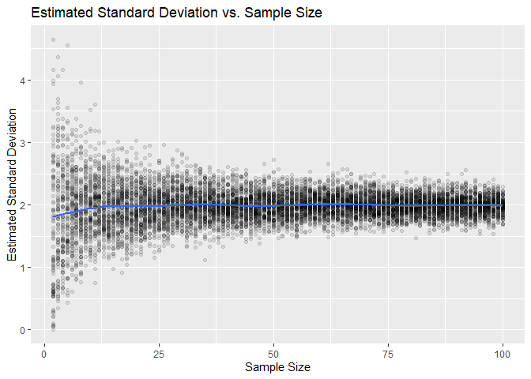
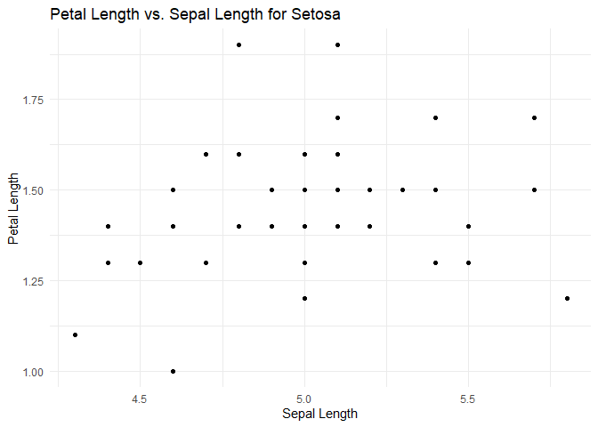

Lab2 - Estymacja parametrów
================
Dzmitry Navumau
February 2024

**Zadanie 1.** *Przypomnienie arytmetyki wektorowej*.

1)  Dany jest wektor liczb zmiennoprzecinkowych `x`. Wyjaśnij, co
    oblicza poniższy kod:

``` r
v <- mean((x-mean(x))^2)
```

2)  Utwórz zmienną całkowitoliczbową `n` z wybraną przez siebie
    wartością od 100 do 5000. Wylosuj `n` obserwacji z rozkładu
    normalnego z wybranymi przez siebie parametrami $\mu$ i $\sigma$,
    korzystając z funkcji `rnorm`. Następnie, wykorzystując jedynie
    funkcję `sum`, oblicz nieobciążony estymator wariancji oraz
    estymatory największej wiarygodności wariancji i odchylenia
    standardowego. Twój kod powinien zająć co najwyżej 7 linijek.  
    Porównaj swoje wyniki z funkcjami `var` oraz `sd`. Jaki estymator
    wariancji jest zaimplementowany domyślnie w R?

**Rozwiązanie zadania 1:**

``` r
x <- seq(from = 1, to = 10, by = 0.1)
v <- mean((x-mean(x))^2)
n <- 700
mean <-  1
sd <-  2
observations <- rnorm(n, mean, sd)
unbiased_variance <- sum((observations - mean(observations))^2) / (n - 1)
mle_variance <- sum((observations - mean(observations))^2) / n
mle_std_dev <- sqrt(mle_variance)
```

    ## Wariancja, estymator nieobciążony: 3.978266

    ## Wariancja, estymator ML: 3.972583

    ## Odchylenie, estymator ML_STD_DEV: 1.993134

**Zadanie 2.** *Trzy estymatory wariancji*

Korzystając z funkcji `rnorm`, wylosuj 5000 obserwacji z rozkładu
normalnego o średniej 0 i wybranym przez siebie odchyleniu standardowym
$\sigma$.  
Przekształć otrzymany wektor w macierz o wymiarach 10 x 500. W każdej
kolumnie wyestymuj wariancję korzystając z funkcji `apply` oraz `var`.
Funkcja `var` zwraca nieobciążony estymator wariancji:
$$\hat{S}^2 = \frac{1}{n-1}\sum_{i=1}^{n} (X_i - \bar{X})^2.$$
Dodatkowo, w każdej kolumnie wyestymuj wariancję korzystając z
estymatorów
$$\hat{S}_1^2 = \frac{1}{n}\sum_{i=1}^{n} (X_i - \bar{X})^2$$ oraz
$$\hat{S}_2^2 = \frac{1}{n+1}\sum_{i=1}^{n} (X_i - \bar{X})^2.$$

**Wskazówka.** Mając wartości estymatora $\hat{S}^2$ w wektorze `S`,
estymator $\hat{S}_1^2$ możesz łatwo otrzymać jako `S1 <- S*9/10`.

Wyestymuj i porównaj obciążenia i odchylenia standardowe wszystkich
trzech estymatorów wariancji. Następnie wyestymuj i porównaj porównaj
błędy średniokwadratowe estymatorów:
$$RMSE = \sqrt{\mathbb{E}(\hat{\theta}-\theta)^2},$$
$$\hat{RMSE} = \sqrt{\frac{1}{n}\sum_{i=1}^n (\hat{\theta}_i - \theta)^2}.$$

Błąd średniokwadratowy mówi nam, jak daleko, średnio rzecz biorąc,
wartość wyestymowana parametru $\theta$ znajduje się od jego wartości
prawdziwej.  
Estymujemy go korzystając z prawdziwej wartości parametru oraz $n$
*realizacji* estymatora, $\hat{\theta}_i$, czyli po prostu tego co
wyliczamy z macierzy.  
W naszym przypadku parametr $\theta$ to wariancja $\sigma^2$ naszego
rozkładu normalnego.

Na podstawie przeprowadzonych symulacji, który estymator zdaje się mieć
najmniejsze obciążenie? A który najmniejszy błąd średniokwadratowy?

**Rozwiązanie zadania 2:** Na początku dostajemy trzy rożne estymatory:

``` r
n <- 5000
sigma <- 2
true_variance <- sigma^2
observations <- rnorm(n, mean = 0, sd = sigma)
matrix <- matrix(observations, nrow = 10, ncol = 500)
S <- apply(matrix, 2, var)
S1 <- S * (10 - 1) / 10
S2 <- S * (10 - 1) / (10 + 1)
```

Policzmy obciązenia wsystkich estymatorów. Widzimy że estymator
$\hat{S}^2$ ma najmniejsze obciązenie

``` r
bias_S <- mean(S) - true_variance
bias_S1 <- mean(S1) - true_variance
bias_S2 <- mean(S2) - true_variance
```

    ## Bias for S Variance Estimator: -0.0418

    ## Bias for S1 Variance Estimator: -0.4376

    ## Bias for S2 Variance Estimator: -0.7615

Liczymy odchylenie standartowe. Najmniejsze ma $\hat{S}_2^2$

``` r
std_S <- sd(S)
std_S1 <- sd(S1)
std_S2 <- sd(S2)
```

    ## Standart derivation for S Variance Estimator: 1.9170

    ## Standart derivation for S1 Variance Estimator: 1.7253

    ## Standart derivation for S2 Variance Estimator: 1.5685

Obliczając błędy sredniokwadratowe, dostajemy najmniejszy błąd dla
$\hat{S}_1^2$

``` r
RMSE_S <- sqrt(mean((S - true_variance)^2))
RMSE_S1 <- sqrt(mean((S1 - true_variance)^2))
RMSE_S2 <- sqrt(mean((S2 - true_variance)^2))

RMSE_mean_S <- sqrt(mean((S - true_variance)^2) * 1 / 10)
RMSE_mean_S1 <- sqrt(mean((S1 - true_variance)^2) * 1 / 10)
RMSE_mean_S2 <- sqrt(mean((S2 - true_variance)^2) * 1 / 10)
```

    ## RMSE for S Variance Estimator: 1.9155

    ## RMSE for S1 Variance Estimator: 1.7783

    ## RMSE for S2 Variance Estimator: 1.7421

    ## RMSE mean for S Variance Estimator: 0.6057

    ## RMSE mean for S1 Variance Estimator: 0.5623

    ## RMSE mean for S2 Variance Estimator: 0.5509

**Zadanie 3.** *Estymator odchylenia standardowego.* Domyślny estymator
odchylenia standardowego w R to pierwiastek z nieobciążonego estymatora
wariancji. Czy taki estymator jest obciążony? Dlaczego? Czy średnio
rzecz biorąc zwraca wartości niższe, czy wyższe od prawdziwych?

Zbadamy empirycznie zależność obciążenia od liczebności próby z której
estymujemy odchylenie. Celem tego zadania jest utworzenie wykresu
punktowego, który przedstawi wartość estymowanego odchylenia
standardowego w zależności od liczebności próby.

Napisz funkcję o nazwie `sample_sd`, która przyjmie dwa argumenty, `N`
oraz `n`, wylosuje `N` prób rozmiaru `n` z rozkładu normalnego (o
wybranym przez Ciebie prawdziwym odchyleniu standardowym) i zwróci `N`
estymowanych odchyleń standardowych. Wykorzystaj funkcje `matrix` i
`apply` tak jak w poprzednim zadaniu.  
Ciało funkcji powinno mieć co najwyżej 4 linijki kodu.

Następnie utwórz wektor `n <- 2:100`.  
Korzystając ze swojej funkcji, dla każdej wartości z wektora `n`
otrzymaj 100 estymowanych odchyleń standardowych.  
Właśnie tutaj przyda Ci się funkcja `sapply`, którą możesz wykorzystać w
następujący sposób: `sapply(n, sample_sd, N=100)`.  
Wszystkie argumenty znajdujące się za nazwą funkcji wywoływanej w
`sapply` zostaną przekazane tejże funkcji, tak jak w tym przypadku
argument `N`.

Korzystając w ten sposób z funkcji `sapply`, otrzymasz macierz, która w
każdej kolumnie będzie zawierała po sto odchyleń standardowych (funkcja
`sapply` składa otrzymane wyniki kolumna do kolumny). Żeby otrzymać
wykres będący celem tego zadania, należy taką macierz przekształcić do
ramki danych o dwóch kolumnach. Jedna z nich musi zawierać estymator, a
druga - liczebność próby.

Żeby otrzymać pierwszą kolumnę, musimy ,,spłaszczyć’’ naszą macierz.  
Najprostszy sposób żeby spłaszczyć macierz `M` to wywołać komendę
`c(M)`, która połączy kolejne kolumny jedna za drugą (dla przypomnienia,
funkcja `c` służy do łączenia wektorów).  
W ten sposób na pierwszych stu współrzędnych otrzymamy odchylenia
estymowane z 2 obserwacji, na następnych stu z 3 obserwacji itd.

Wektor zawierający liczebności próby odpowiadajace kolejnym obserwacjom
otrzymamy komendą `rep(n, each=100)`.  
Funkcja `rep` służy do powtarzania wartości z pewnego wektora. Wywołanie
`rep(1:3, 3)` powtórzy trzykrotnie cały wektor `1:3`, a wywołanie
`rep(1:3, each=3)` powtórzy trzykrotnie każdą z wartości wektora `1:3`.
Porównaj oba wyniki, wywołując te dwie komendy w konsoli.

Na koniec, utwórz wykres punktowy obrazujący zależność estymowanego
odchylenia od liczności próby. Zaraz za estetykami dodaj argument
`alpha=0.1`, aby punkty były nieco przezroczyste. Wykres stanie się w
ten sposób bardziej czytelny.  
Dodatkowo, nałóż na wykres warstwę `geom_smooth(aes(x=n, y=SD))`, która
wykreśli krzywą obrazującą (w pewnym sensie) typowe wartości na
wykresie. Na tym przedmiocie niestety nie mamy czasu aby dokładnie
omówić w jaki sposób wyliczana jest ta krzywa.

Jakie wnioski możesz wyciągnąć z otrzymanego wykresu?

**Rozwiązanie zadania 3:** Zdefiniujmy funkcje dla generacji probki dla
standartowego odchylenia 2

``` r
sample_sd <- function(N, n) {
  samples <- matrix(rnorm(N * n, sd = 2), nrow = N)
  sds <- apply(samples, 1, sd)
  return(sds)
}
```

Wylosujmy probe dla róznych liczbnosci i zrobimy z tego jedyny
`data.frame`

``` r
n <- 2:100
sd_estimates <- sapply(n, sample_sd, N = 100)
sd_to_plot <- data.frame('SD'=c(sd_estimates), 'n'=rep(n, each=100))
```

Przedstawmy otrzymaną zależność na wykresie

``` r
plot <- ggplot(sd_to_plot, aes(x = n, y = SD)) +
  geom_point(alpha = 0.1) +
  geom_smooth(method = 'gam', formula = y ~ s(x, bs = "cs")) +
  labs(title = "Estimated Standard Deviation vs. Sample Size",
       x = "Sample Size",
       y = "Estimated Standard Deviation")
plot
```

<!-- -->

**wnioski:**

**Zmniejszenie zmienności:** W miarę zwiększania się rozmiaru próbki
zmienność estymat odchylenia standardowego wydaje się zmniejszać. Można
to zauważyć po zmniejszeniu rozproszenia punktów wzdłuż osi pionowej, w
miarę przesuwania się w prawo wzdłuż osi poziomej.

**Zbieganie do prawdziwej wartości:** Wraz ze zwiększaniem się rozmiaru
próbki, estymaty odchylenia standardowego prawdopodobnie zbliżają się do
prawdziwej wartości odchylenia standardowego całej populacji. Jeśli
prawdziwa wartość jest znana, może być dodana do wykresu dla wizualnego
porównania.

**Efekt prawa wielkich liczb:** Wykres demonstruje prawo wielkich liczb,
ponieważ zwiększając rozmiar próbki, estymaty stają się mniej
rozproszone i bardziej skoncentrowane wokół prawdziwej wartości
parametru.

**Zadanie 4.** Załaduj dane `iris`. Wybierz dane dotyczące gatunku
*setosa*. W tym celu najlepiej skorzystać z jeszcze jednego typu
indeksowania, czyli *indeksowania logicznego* (a jakie dwa inne typy
poznaliśmy na poprzednich zajęciach?).  
Indeksowanie logiczne wygląda następująco:
`setosa_data <- iris[iris$Species == 'setosa', ]`. To, co tu się dzieje,
to po kolei:

- Komenda `iris$Species` wybiera kolumnę o nazwie `Species`.
- Komenda `iris$Species == 'setosa'` porównuje wartości w tej kolumnie z
  napisem ‘setosa’ i zwraca wektor logiczny. Jeżeli chcemy, to możemy
  wynik tej komendy przypisać na nową zmienną:
  `is_this_setosa <- iris$Species == 'setosa'`.
- Komenda `iris[iris$Species == 'setosa', ]` wybiera wszystkie kolumny
  tabeli `iris` oraz te wiersze, w których w wektorze logicznym z
  poprzedniego punktu znajduje się wartość `TRUE`.

Po wybraniu danych dotyczących gatunku *setosa*, oblicz średnią oraz
odchylenie standardowe zmiennych `Sepal.Width` oraz `Sepal.Length`.  
Następnie oblicz korelację tych zmiennych korzystając z funkcji `cor`.
Porównaj ją z korelacją zmiennych `Petal.Length` oraz `Sepal.Length`.

Korelacja zmiennych losowych mierzy, na ile silna jest zależność liniowa
pomiędzy tymi zmiennymi. Korelacja pomiędzy zmiennymi $X, Y$ jest równa
$\pm 1$ wtedy i tylko wtedy, gdy $X = aY + b$ dla pewnych liczb
rzeczywistych $a, b$.  
Co możesz wywnioskować o zależności pomiędzy zmiennymi `Sepal.Width` a
`Sepal.Length` na podstawie ich korelacji? A pomiędzy `Petal.Length` a
`Sepal.Length`?  
Korzystając z biblioteki `ggplot2`, utwórz wykresy punktowe obrazujące
zależność pomiędzy `Sepal.Width` a `Sepal.Length` oraz pomiędzy
`Petal.Length` a `Sepal.Length` i sprawdź, czy Twoje wnioski były
poprawne.

**Rozwiązanie zadania 4:**

``` r
data("iris")
setosa_data <- iris[iris$Species == 'setosa', ]
```

Obliczmy srednie i odchylenia standartowe

``` r
mean_sepal_width <- mean(setosa_data$Sepal.Width)
sd_sepal_width <- sd(setosa_data$Sepal.Width)
```

    ## mean Sepal.Width: 3.428

    ## sd Sepal.Width: 0.3790644

``` r
mean_sepal_length <- mean(setosa_data$Sepal.Length)
sd_sepal_length <- sd(setosa_data$Sepal.Length)
```

    ## mean Sepal.length: 5.006

    ## sd Sepal.length: 0.3524897

Obliczmy wspolczynniki korelacji Pirsona

``` r
correlation_sepal <- cor(setosa_data$Sepal.Width, setosa_data$Sepal.Length)
correlation_petal <- cor(setosa_data$Petal.Length, setosa_data$Sepal.Length)
```

    ## Korelacja między Sepal.Width oraz Sepal.Length: 0.7425467

    ## Korelacja między Petal.Length oraz Sepal.Length: 0.2671758

Na podstawie czego można wnioskować, że jest liniowa zalęzność pomiędzy
`Sepal.Width` oraz `Sepal.Length`. Jednak `Petal.Length` oraz
`Sepal.Length` słabo są ze sobą powiązane.

Przedstawmy tę zależnosci na wykresach, by się upewnić

``` r
ggplot(setosa_data, aes(x = Sepal.Length, y = Sepal.Width)) +
  geom_point() +
  labs(title = "Sepal Width vs. Sepal Length for Setosa",
       x = "Sepal Length",
       y = "Sepal Width") +
  theme_minimal()
```

<!-- -->

``` r
ggplot(setosa_data, aes(x = Sepal.Length, y = Petal.Length)) +
  geom_point() +
  labs(title = "Petal Length vs. Sepal Length for Setosa",
       x = "Sepal Length",
       y = "Petal Length") +
  theme_minimal()
```

<!-- -->

Jak widzimy, informacja na wykresach potwierdza po raz kolejny
prawdziwość tezy o liniowej zależnosci.

## Zadania dodatkowe.

**Zadanie 1.** Rozegraj jedną rundę w [Guess the
Correlation](http://guessthecorrelation.com/). Jeśli zamierzasz wykonać
to zadanie w laboratorium, wyłącz głośniki.

**Zadanie 2.** Wyestymuj pole koła o promieniu 1 metodą Monte Carlo. W
tym celu:

- Wylosuj $n$ punktów z kwadratu \[0, 1\] x \[0, 1\]. Ustaw je w macierz
  o wymiarach $2 \times n$.
- Napisz funkcję, która przyjmie punkt (wektor długości 2) i sprawdzi,
  czy należy on do koła o promieniu 1.
- Wykorzystaj tę funkcję, funkcję `apply` oraz funkcję `mean` do
  sprawdzenia, jaka proporcja wylosowanych punktów należy do koła.
- Wykorzystaj obliczoną proporcję do estymacji pola koła.
- Porównaj wyniki dla różnych wartości `n`.

*Wskazówka.* Całe to zadanie można zrealizować w 8 linijkach kodu.

**Rozwiązanie zadania 2:** Będzimy potrzebowali dwie funckje:

Pierwsza sprawdza czy pukt trafił do koła

``` r
is_in_circle <- function(point) {
  x <- point[1]
  y <- point[2]
  return(x^2 + y^2 <= 1)
}
```

Druga oblicza jaka część punktów trafiła do koła

``` r
calculate_proportion <- function(points_matrix) {
  inside <- apply(points_matrix, 2, is_in_circle)
  mean(inside)
}
```

Teraz tworzymy macierz punktów:

``` r
n <- 10000
random_matrix <- matrix(runif(2 * n), nrow = 2)
```

Estymatorem może byc cześć punktów która trafiła:

    ## [1] 0.7846

**Zadanie 3.**. Zbadaj obciążenie estymatora z poprzedniego zadania.

**Rozwiązanie zadania 3:** Dlatego żeby zbadać obciązenie musimy
powtórzyć nasz eksperyment ustaloną liczbę razy:

``` r
calculate_circle_area <- function(n) {
  points_matrix <- matrix(runif(2 * n), nrow = 2)
  proportion_inside <- calculate_proportion(points_matrix)
  estimated_area <- proportion_inside
  return(estimated_area)
}

num_experiments <- 100

area_estimates <- replicate(num_experiments, calculate_circle_area(n))

mean_estimate <- mean(area_estimates)

true_area <- pi

bias <- mean_estimate - true_area
```

    ## Mean estimate: 0.785087

    ## True area: 3.141593

    ## Bias: -2.356506

## Prydatna informacja

#### Macierze

Mając wektor `x`, możemy przekształcić go w macierz o `n` wierszach i
`m` kolumnach komendą `matrix(x, nrow=n, ncol=m)`.  
Wypełnianie macierzy domyślnie odbywa się kolumna po kolumnie. Możemy
również wypełniać ją wiersz po wierszu podając argument `byrow=TRUE`.  
Jeśli wektor ma mniej niż `nm` elementów, to nastąpi jego *recykling* -
po wyczerpaniu wartości z `x` wracamy do jego początku i wypełniamy
macierz dalej.  
Jeśli podamy wyłącznie argument `nrow` (lub `ncol`), liczba kolumn
(wierszy) zostanie dobrana automatycznie.  
Przetestuj działanie komendy `matrix`, wpisując w konsolę
`matrix(1:9, ncol=3)` oraz `matrix(1:6, ncol=3)`.

Mając macierz `M`, możemy przyłożyć dowolną funkcję kolejno do
wszystkich wierszy lub kolejno do wszystkich kolumn.  
Pozwala to na przykład w prosty sposób otrzymać średnią z każdej
kolumny. W tym celu wykorzystujemy funkcję `apply(X, n, f)`, gdzie `X`
to macierz wejściowa, `F` to funkcja, a `n` oznacza czy chcemy przyłożyć
`F` do wierszy (`n=1`) czy kolumn (`n=2`) macierzy `X`.  
Przetestuj działanie komendy `apply`, wpisując w konsolę
`M <- matrix(1:9, ncol=3)`, a następnie `apply(M, 2, mean)` oraz
`apply(M, 1, sum)`.

Macierze i komenda `apply` będą jednymi z najczęściej wykorzystywanych
przez nas narzędzi pakietu R.  
Warto zatem dobrze zrozumieć ich działanie i wiedzieć, w jakich
sytuacjach ich używać.

#### Funkcje

Spotkaliśmy się już z gotowymi funkcjami w R, na przykład `var`.  
Własne funkcje natomiast piszemy w następujący sposób:

``` r
S2var <- function(X){
  # Funkcja obliczajaca estymator wariancji S2 na podstawie wektora X.
  m <- mean(X)
  v <- sum((x-m)^2)/(length(X)+1)  # funkcja length(X) zwraca długość wektora X
  return(v)
}
```

Powyższy kawałek kodu utworzy funkcję o nazwie `S2var`, która przyjmuje
wektor `X` i zwraca wartość estymatora wariancji $\hat{S}_2^2$. Zwróćmy
uwagę, że w R przypisujemy funkcję na zmienną, tak samo jak dowolny inny
typ danych.

Bardzo odradzam pisanie własnych funkcji w konsoli. Na ogół są to już
nieco dłuższe kawałki kodu i zbyt łatwo popełnić w nich błąd. Funkcje
należy pisać albo w skryptach, albo w notatnikach Rmarkdown. Wyjątkiem
wobec tej reguły jest pisanie funkcji bezpośrednio w `apply`, na
przykład:

``` r
M <- matrix(1:9, ncol=3)
M
apply(M, 2, function(x) x^x[1])
```

Powyższy kawałek kodu utworzy macierz M, wypisze ją w konsoli, a
następnie obliczy macierz, w której każda kolumna zostanie podniesiona
do potęgi o wykładniku równym pierwszemu elementowi tej kolumny. Czyli
kolumna druga zostanie podniesiona do potęgi czwartej, a kolumna trzecia
do potęgi siódmej.

Przyda się nam również funkcja `sapply`.  
Jest to po prostu uproszczone `apply`, które działa nie na macierzach, a
na wektorach. Na przykład, `sapply(X, function(x) x^2)` podniesie każdy
element wektora `X` do kwadratu, czyli zwróci to samo, co napisanie
`X^2`.
